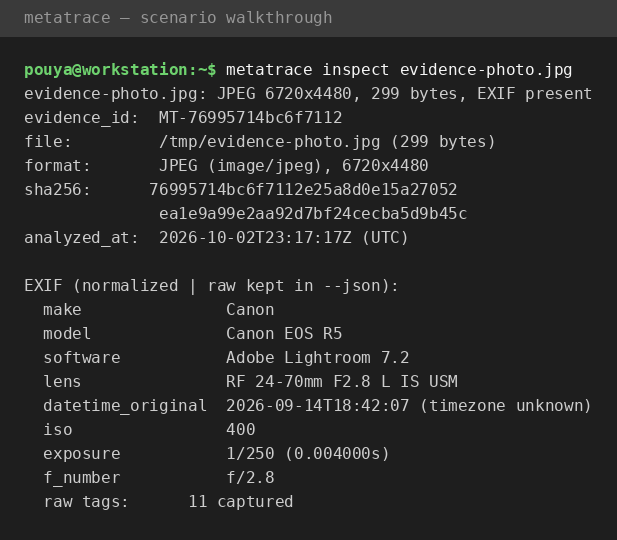
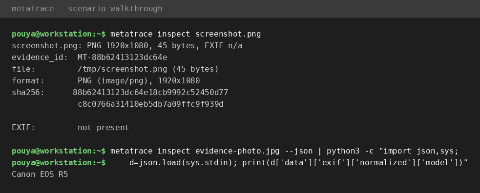
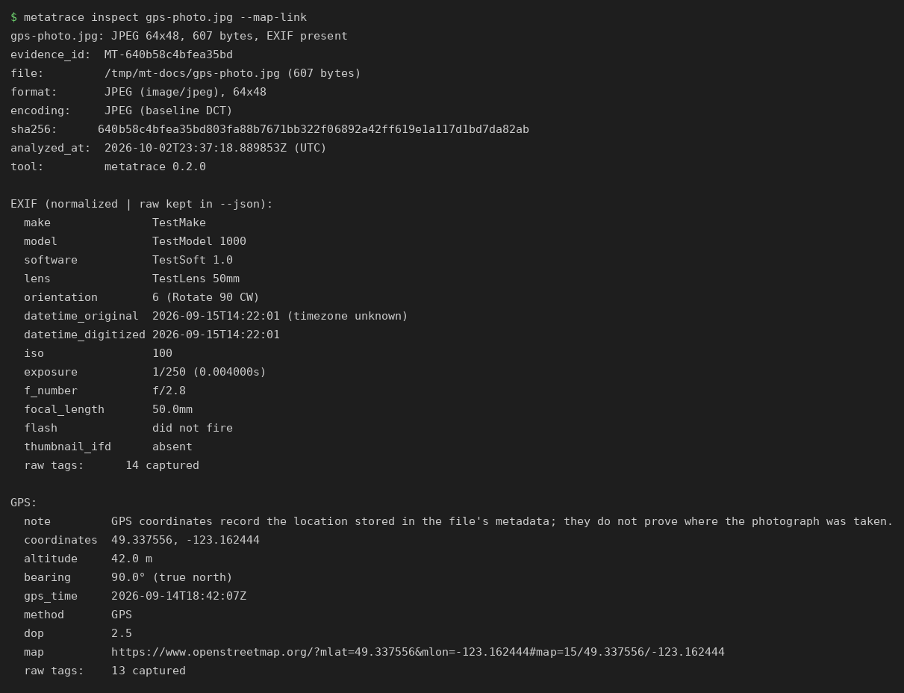
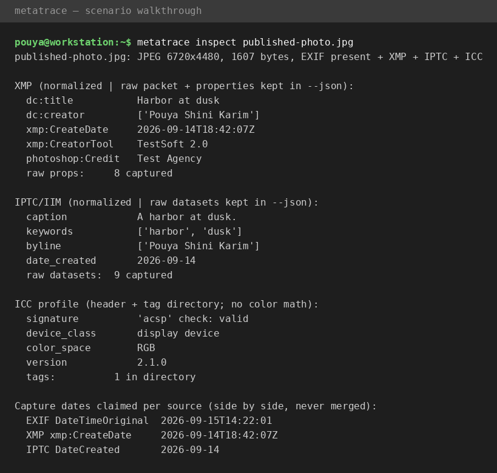
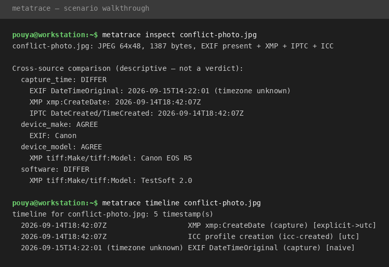
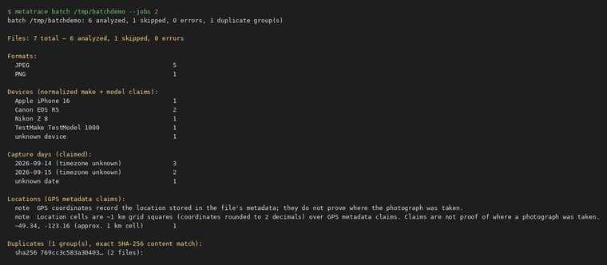

# MetaTrace in action — scenario walkthrough

> **Scenario:** a photo arrives as evidence. Someone claims it was taken
> on a specific camera, on a specific date. Your job: extract everything
> the file can technically tell you — and separate what you *observe*
> from what you *conclude*.
>
> Every command below is real output from MetaTrace v0.4.0
> (screenshots 01–02 were captured under v0.1.0, 03 under v0.2.0,
> 04 under v0.3.0; step 7 is new in v0.4.0).

## Step 1 — Identify and hash the evidence

Before anything else, identify the file and record its integrity. The
source file is never modified; the hash is captured first.

```
$ metatrace inspect evidence-photo.jpg
```



You immediately have: format and dimensions, a SHA-256 fingerprint, an
evidence ID, and the tool version — everything needed to reference this
file defensibly later.

## Step 2 — Read what the camera wrote

The EXIF block is the camera's own testimony: make and model, lens,
capture timestamp, exposure settings. MetaTrace shows normalized fields
for quick reading and keeps every raw tag value in `--json` for
verification.

Observations from this file:

- **Device:** Canon EOS R5 with an RF 24-70mm lens
- **Captured:** 2026-09-14T18:42:07 (timezone not recorded — noted, not assumed)
- **Settings:** ISO 400, 1/250s, f/2.8 — consistent with a real exposure
- **Software tag:** Adobe Lightroom 7.2 — the file passed through editing software

That last line is exactly where MetaTrace's discipline matters: the
software tag is an *observation*. It means the file went through
Lightroom, not that the image is fake. Metadata can be rewritten, copied,
or stripped — the tool reports, you interpret.

## Step 3 — Handle the file with no story

Not every image carries metadata. A screenshot, for example, has no EXIF
at all — and that absence is itself a finding, reported cleanly instead
of erroring out:

```
$ metatrace inspect screenshot.png
screenshot.png: PNG 1920x1080, 45 bytes, EXIF n/a
...
EXIF:         not present
```



## Step 4 — Read the location claim (v0.2: GPS normalization)

When the file carries a GPS IFD, MetaTrace decodes it into decimal
coordinates, altitude, bearing, and a UTC timestamp — and validates
everything. Degrees/minutes/seconds rationals become signed decimals;
out-of-range values (latitude 95°, a 20000 m altitude) become explained
findings, never silent drops:

```
$ metatrace inspect gps-photo.jpg --map-link
```



Observations from this file:

- **Coordinates:** 49.337556, -123.162444 (from 49°20'15.2"N 123°09'44.8"W)
- **Altitude:** 42.0 m above sea level · **Bearing:** 090° true north
- **GPS time:** 2026-09-14T18:42:07Z — recorded alongside, not merged
  with, the camera's `DateTimeOriginal` (2026-09-15T14:22:01, timezone
  unknown). Two clocks, two claims; the cross-check is yours to make.
- `--map-link` prints an OpenStreetMap URL for the coordinates. It only
  *builds* the URL — no network request is made, ever.

And the discipline, stated on every run: GPS coordinates record the
location **stored in the file's metadata**; they do not prove where the
photograph was taken. Metadata says; it never testifies.

## Step 5 — Read the publisher's labels (v0.3: XMP/IPTC/ICC)

A photo that has been through an editor, a newsroom, or a stock agency
often carries more than the camera's EXIF. MetaTrace now reads the
three other metadata standards that travel inside image files:

- **XMP** — Adobe's RDF/XML packet (JPEG APP1, PNG iTXt, WebP XMP
  chunk, TIFF tag 700): Dublin Core title/creator/rights, XMP Basic
  dates and rating, Photoshop credit/source.
- **IPTC/IIM** — the newsroom standard (JPEG APP13 Photoshop IRB):
  caption, keywords, byline, credit, copyright, creation date/time.
- **ICC** — the embedded color profile (JPEG APP2, PNG iCCP, TIFF tag
  34675): header fields (device class, color space, version, creation
  time, `acsp` signature check) plus the tag directory. No color math —
  the directory says what the profile claims to carry, which is what
  forensics needs first.

```
$ metatrace inspect published-photo.jpg
```



Observations from this file:

- **XMP:** title "Harbor at dusk", creator "Pouya Shini Karim",
  `xmp:CreateDate` 2026-09-14T18:42:07Z, rating 4, credit "Test Agency".
  The raw packet (912 chars) is kept verbatim in `--json`.
- **IPTC:** caption "A harbor at dusk.", keywords harbor/dusk, byline
  "Pouya Shini Karim", `DateCreated` 2026-09-14. All 9 datasets kept
  raw, including ones MetaTrace doesn't normalize by name.
- **ICC:** valid `acsp` signature, display-device profile, RGB → XYZ,
  version 2.1.0, one tag in the directory.
- **Three dates, three claims:** EXIF says 2026-09-15T14:22:01, XMP says
  2026-09-14T18:42:07Z, IPTC says 2026-09-14. MetaTrace shows them side
  by side and **never merges them** — deciding whether they agree is
  the v0.6 anomaly engine's job, not this parser's.

Defensive as ever: malformed XMP XML becomes a warning (the packet
still counts as observed), truncated IPTC records keep partial
results, and an ICC profile that fails the `acsp` check is reported
with `signature_valid: false` plus a medium-severity finding.

## Step 6 — Feed the machines

Every inspection also emits a stable JSON envelope for case files,
pipelines, and later correlation:

```
$ metatrace inspect evidence-photo.jpg --json
{
  "tool": "metatrace",
  "version": "0.3.0",
  "command": "inspect",
  "timestamp": "2026-10-02T23:17:17Z",
  "status": "ok",
  "data": { "identity": {...}, "exif": {...}, "xmp": {...}, "iptc": {...}, "icc": {...},
            "timestamps": [...], "device": {...}, "comparison": [...], "timeline": [...] },
  ...
}
```

Exit codes: `0` = ok, `1` = findings/warnings, `2` = error.

## Step 7 — Normalize, compare, and line up time (v0.4)

A photo can carry the same fact in three different standards — and
the three don't always agree. v0.4 parses every timestamp flavor
into one model, normalizes device identity per source, and compares
the claims **descriptively**: agree / differ / only-in-one-source,
with raw values shown. No verdicts, no scores, no auto-resolution —
judging a conflict is the v0.6 anomaly engine's job.

```
$ metatrace inspect conflict-photo.jpg
$ metatrace timeline conflict-photo.jpg
```



Observations from this file:

- **Timestamps, one model:** EXIF `DateTimeOriginal` is timezone-naive
  (`value_utc: null` — MetaTrace never invents a timezone), XMP
  `xmp:CreateDate` carries `Z`, IPTC `DateCreated`+`TimeCreated`
  carries `+0000`; all three normalize to comparable instants.
- **capture_time: DIFFER** — the camera claims 2026-09-15T14:22:01
  (naive), the publisher's XMP/IPTC claims 2026-09-14T18:42:07Z.
  MetaTrace records the difference and shows both raws; it does not
  pick a winner.
- **device_make / device_model: AGREE** — EXIF says `canon` /
  `canon eos r5`, XMP says `Canon ` / `EOS R5`. Different spellings,
  same device: normalization sees through the variants while the raw
  strings stay verbatim in `--json`.
- **software: DIFFER** — EXIF `TestSoft 1.0` vs XMP `TestSoft 2.0`.
  Recorded, not judged.
- **Timeline:** `metatrace timeline` lines every claim up
  chronologically — UTC-known first, then the naive EXIF claim by
  wall-clock, each labeled with its source. The filesystem mtime is
  listed too, explicitly marked *not image metadata*.

Unparseable timestamps (a garbage XMP date, an IPTC date that isn't
a date) are kept verbatim with `parseable: false` and surface a
low-severity finding — never a silent drop, never a crash.

## Step 8 — Triage a whole directory (v0.5: batch analysis)

A case rarely arrives as one file. Point MetaTrace at a directory and
it runs the full pipeline — identify, hash, EXIF/XMP/IPTC/ICC,
normalize, compare — on every recognized image, in parallel:

```
$ metatrace batch /tmp/batchdemo --jobs 2
```



Observations from this run:

- **Magic bytes, not extensions:** `README.txt` is skipped with a
  recorded reason instead of crashing the batch. Seven files in,
  six analyzed, one skipped, zero errors.
- **Duplicates:** `harbor-01.jpg` and `harbor-01-copy.jpg` are
  byte-identical (SHA-256) — one duplicate group. Exact content
  match only; perceptual near-duplicate grouping is v0.7's job.
- **Devices:** the normalized claims sort the set into Canon EOS R5
  ×2, Nikon Z 8, Apple iPhone 16, and one file whose device is
  unknown — no manual sorting.
- **Locations:** the iPhone shot's GPS claim lands in the
  `~49.34, -123.16` grid cell, and the output repeats the
  disclaimer twice: coordinates are metadata claims, never proof of
  where a photo was taken.
- **Conflicts counted, not judged:** `agency-04.jpg` has EXIF and
  XMP disagreeing on capture time, so the summary counts one file
  with conflicting timestamp claims — descriptive, exactly like the
  single-image comparison in Step 7.
- **Machine formats:** `--json` emits per-file analyses plus the
  summary and groups (stable, deterministic ordering — same input
  twice gives byte-identical output modulo timestamps); `--csv`
  emits one row per file for spreadsheets. `--timeline` adds the
  cross-image timeline.

A progress line (`N/M files`) goes to stderr on human runs and stays
silent under `--json`/`--csv`, so pipelines never see it.

## What's next

v0.5 covers identification, hashing, full EXIF, GPS normalization,
XMP/IPTC/ICC extraction, timestamp and device normalization,
descriptive cross-source comparison, single-image timelines, and
batch analysis with duplicate detection and grouping. The
roadmap adds the anomaly engine, thumbnail
inspection, case management, and full reporting — each on the same
evidence-first foundation.
